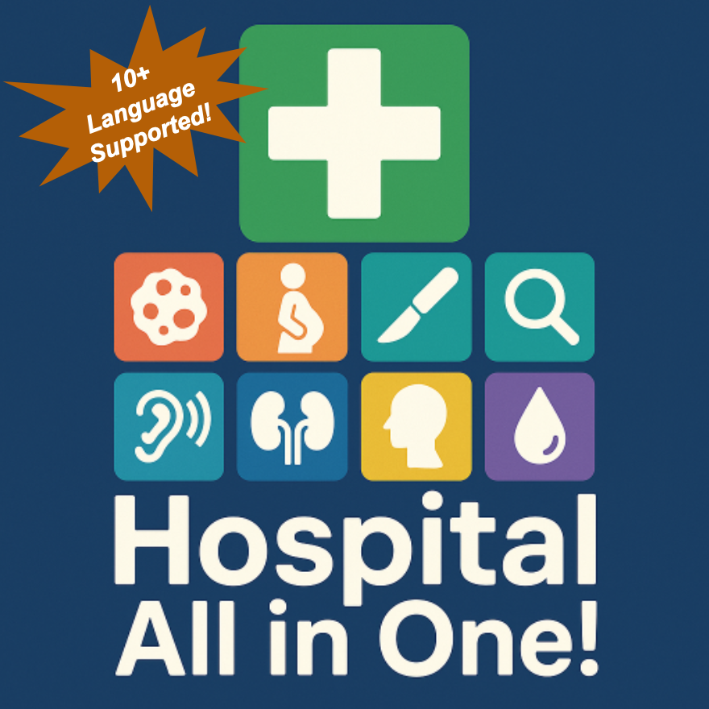

# HAO: Hospital All in One!

<div align="center">

</div>

This MOD is designed to **integrate all current department-type MODs**, eliminate incompatibilities between them as much as possible, and reduce dependency on extra packages. Just by subscribing to this mod, you can experience the content of ten new departments beyond the base game, and it's fully compatible!

This mod has been tested for over **100 in-game days** and is compatible with all current DLCs, and **have 10+ languages translated**!

If you encounter any bugs, have content you'd like to see integrated, or want to provide a translation, please leave a comment, and I will update it in a timely manner.

If you have content that you do not want to be integrated, please contact me promptly, and I will remove it as soon as possible.

I hope you have a great time playing :D

## Department All in One
* [Oncology](https://steamcommunity.com/sharedfiles/filedetails/?id=1938136264&searchtext=Diagnose)
* [Obstetrics and Gynecology](https://steamcommunity.com/sharedfiles/filedetails/?id=1920731522)
* [Plastic Surgery](https://steamcommunity.com/sharedfiles/filedetails/?id=2137302545)
* [Otolaryngology (ENT)](https://steamcommunity.com/sharedfiles/filedetails/?id=1998013270)
* [Nephrology and Urology](https://steamcommunity.com/sharedfiles/filedetails/?id=2137734594)
* [Diagnostics Department](https://steamcommunity.com/sharedfiles/filedetails/?id=3158427011)
* [Psychology](https://steamcommunity.com/sharedfiles/filedetails/?id=3024817031)
* [Hematology](https://steamcommunity.com/sharedfiles/filedetails/?id=3163091222)
* **Dermatology and Venereology**: Based on [Sexual Health Department](https://steamcommunity.com/sharedfiles/filedetails/?id=1872963449), adding 20+ dermatology-related diagnostics, symptoms, examinations, and treatments to keep the inpatient department busy!
* **Ophthalmology**: A department I created myself, focusing on treating eye-related diseases, including 50+ ophthalmological conditions and their related symptoms, examinations, and treatments!
* **Oral and Maxillofacial Surgery**: Original department by me, with 40+ oral and maxillofacial diseases, symptoms, examinations, and treatments! (NEW+++)

## Additional Content All in One
* [More Professions](https://steamcommunity.com/sharedfiles/filedetails/?id=1804176680)
* [Realistic Collapse and Disease Incidence](https://steamcommunity.com/sharedfiles/filedetails/?id=2704509476)
* More Insurance Companies: [Anthem, Inc. Insurance](https://steamcommunity.com/sharedfiles/filedetails/?id=2311624989), [United Healthcare](https://steamcommunity.com/sharedfiles/filedetails/?id=2312636767), [Kaiser Foundation Insurance](https://steamcommunity.com/sharedfiles/filedetails/?id=2311625277), [Progressive Insurance Company](https://steamcommunity.com/sharedfiles/filedetails/?id=1776512699&searchtext=Insurence), [Chaos Care Insurance](https://steamcommunity.com/sharedfiles/filedetails/?id=3128718973&searchtext=Insurence)
* [More Diseases](https://steamcommunity.com/sharedfiles/filedetails/?id=2015448513)
* [Hypochondriac](https://steamcommunity.com/sharedfiles/filedetails/?id=1995976999)
* [Medical Procedure](https://steamcommunity.com/sharedfiles/filedetails/?id=2167731584)

## Gameplay Adjustments
* Maximum number of insurance companies set to 36.
* Maximum number of floors set to 12.
* Extended the time it takes for patients to collapse and significantly extended the time before patients leave.
  * This is because having too many departments means patients must undergo numerous tests before a diagnosis can be made.
* Significantly increased the learning efficiency of staff training.
* Set the rate at which floors get dirty to 0.
  * With all departments built, a hospital with 200+ daily patients requires 800+ employees to run smoothly, which poses a significant performance challenge. Reducing the need for janitors can alleviate some performance pressure.
  * However, you will still need to hire janitors, as I have not removed patient bleeding.

## Compatibility Adjustments
* Removed the labs from the Otolaryngology and Sexual Health departments, as their tests can be performed in the general medical lab. This reduces costs and is more realistic.
* Retained only the mental health-related illnesses from the Psychology department to avoid excessive overlap with the base game's Neurology department.
* Fixed the sleep lab in the Otolaryngology department; it can now be built correctly.
* Fixed the surgery execution issue in the Diagnostics Department; it can now correctly borrow surgeons from General Surgery and Neurology.
* Adjusted the diseases for each department to ensure every condition is handled by the most appropriate department.
* Consolidated some functionally identical examinations to reduce the number of tests ordered by doctors, and removed all symptoms, examinations, and treatments that were not used by any disease.
* Adjusted the patient generation weights for each department to better reflect reality.
* Adjusted the logos of various departments, now their styles are more consistent with the base-game department logos!
* Removed COVID-19 vaccinations from Medical Procedures as they were somewhat repetitive and seemed a bit outdated after the pandemic :D
* Updated the mod icon sizes to be more consistent with the base game's icon sizes.

## Language Support
* Fine Translation: English🇬🇧🇺🇸, Simplified Chinese🇨🇳
* Translated with LLMs: Czech🇨🇿, German🇩🇪, Spanish🇪🇸, French🇫🇷, Hungarian🇭🇺, Italian🇮🇹, Japanese🇯🇵, Korean🇰🇷, Dutch🇳🇱, Polish🇵🇱, Portuguese🇵🇹🇧🇷, Russian🇷🇺, Turkish
🇹🇷, Traditional Chinese

## How to Install

### Install with Github

If you downloaded from Github, download all the files, place them in a `ModHAO` folder, and then [move it to the `Addons` path](https://www.reddit.com/r/ProjectHospital/comments/twcobr/any_way_to_manualy_add_mods/).

The final path should look something like this:
```
Addons
└──ModHAO
   ├── Assests
   ├── Database
   ├── Prefab
   └── ...
```

### Install on Windows

Due to differences in path formats between operating systems, before running on Windows, you need to modify all paths in all `.xml` files within `(ModAssetLists)[./Database/ModAssetLists]` by replacing `/` with `\`.

Alternatively, you can try a script I wrote, `(windows_transfer.psl)[targetDirectory]`. Change `targetDirectory` to the path of your `ModAssetLists` and run it. However, as I do not have a Windows device at the moment, I cannot confirm if it is bug-free.

### Compatible with Other Mods

Before installing this MOD, you need to unsubscribe from the individual MODs that have been integrated into this pack.

If you have a save that relies on integrated department MODs, first close that department and the emergency department. After all patients from that department have left, you can unsubscribe from the previous department MOD and then subscribe to this one!
